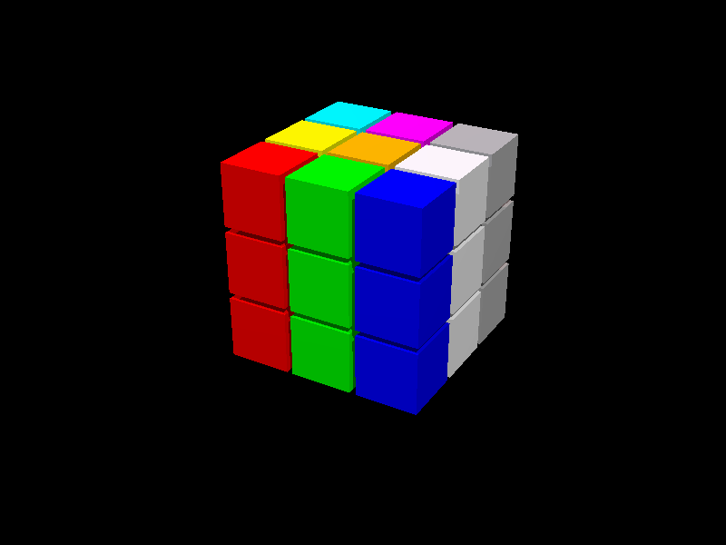

# RayTracer

This project is a ray tracing application developed in Python, designed to render 3D scenes by simulating the way rays of light interact with objects. It utilizes the Persistence of Vision Raytracer (POV-Ray) Scene Description Language (SDL) for scene configuration.

The application is inspired by POV-Ray and leverages its file structure to create scenes. It parses these files to extract parameters, which are then adapted and passed to our solution for rendering. While it is not using the POV-Ray engine in the background, it is highly recommended to run the `.pov` scenes generated by our software in both our application and POV-Ray itself to compare the differences.

## Features

- **3D Rendering**: Generates images by tracing the path of light through pixels in an image plane.
- **Scene Configuration**: Leverages POV-Ray SDL for detailed scene descriptions.
- **POV-Ray Parsing**: Extracts and parses parameters from POV-Ray scene files to generate equivalent scenes in our solution.
- **GUI with Vector Graphics**: Implements a graphical user interface using GooCanvas and GTK, providing interactive vector-based views of the scenes.

## Prerequisites

- **Python**: Ensure Python is installed on your system.
- **POV-Ray**: Install POV-Ray to render the scene files (optional for comparison).
- **GTK**: Install GTK and GooCanvas for the graphical interface.

## Installation

1. **Clone the Repository**:
   ```bash
   git clone https://github.com/MaxiLR/RayTracer.git
   ```
2. **Navigate to the Project Directory**:
   ```bash
   cd RayTracer
   ```

## Usage

1. **Open GUI**:

   ```bash
   python src/main.py
   ```

   This command will open a GUI that allows you to load `.pov` files and render them. The application provides a 3-view plane visualization ('XY', 'ZY', and 'ZX') and an option to raytrace the scene.

2. **Render the Scene**:

   - **Using Our Application**: Run the application to visualize and interact with the parsed scene. For direct rendering, you can use the `trace.py` file:

     ```bash
     python3 trace.py <input_file.pov> 0
     ```

     Replace `<input_file.pov>` with the name of the scene file you want to render.
       

   - **Using POV-Ray**: Render the `.pov` file using POV-Ray to compare the results:
     ```bash
     povray +I<input_file.pov> +W800 +H600 +P
     ```
     Replace `<input_file.pov>` with the name of your scene file.

## Examples

- **Rubik's Cube Scene**:
  
- **Sphere Scene**:
  

## Contributing

Contributions are welcome! Please fork the repository and submit a pull request.

## License

This project is licensed under the MIT License.

## Acknowledgements

This project is a fork of [SantyQ02/Computacion-Grafica](https://github.com/SantyQ02/Computacion-Grafica).
